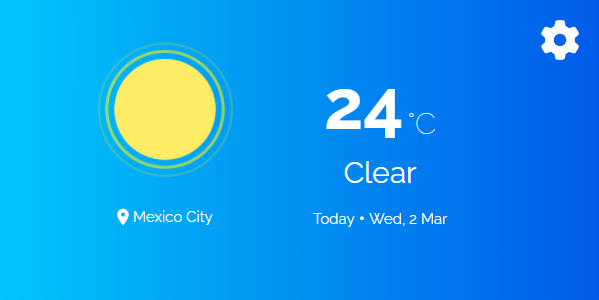
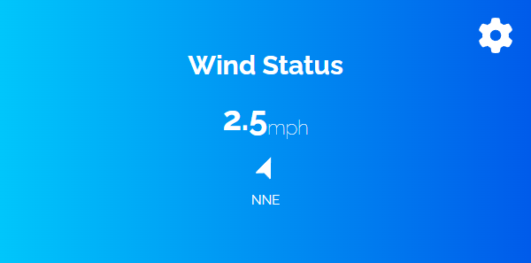
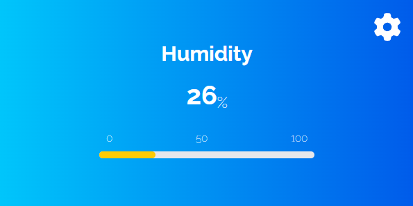
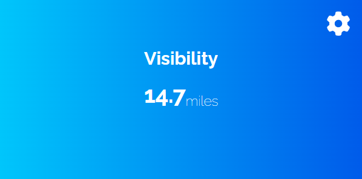

<h1>Climate</h1>
<p>
 <a href=#">
     </a>
 <a href="https://open.spotify.com/playlist/6eDl0FX1pNcaFXgYIBOobX?si=aewrQ2nJTuSgkMSip3d8-Q&utm_source=copy-link">
     </a>
 <a href="https://www.codewars.com/users/Dawnt">
    </a>
 <a href="mailto:jmanuelhv9@gmail.com">
    </a>
</p>

<h3>About</h3>

Web extension for visualization of weather and other climate components.<br>
I created this extension because I found the idea in a web page called [devChallenges](https://devchallenges.io/challenges). It proposed the creation of a web page where you could get information about the weather through an API and thus be able to use the data returned to us to display them on the page. I decided that instead of a web page it would be better to encapsulate everything in an extension. When creating the extension I encountered a problem which was the CORS protocol that prevented me from using the API. In the end I managed to solve it by setting up a personal CORS proxy to act as an intermediary between the extension and the API. I found this project very entertaining as I was able to put into practice my knowledge about JS and the use of APIs.

## What's new in v0.3

-   Smaller and less intrusive design
-   Some basics configurations have been added
-   Loading screens and animations
-   Funds adaptable to the current climate

<!-- TABLE OF CONTENTS -->

## Table of Contents

-   [Overview](#overview)
-   [Features](#features)
-   [How to use](#how-to-use)
-   [Contributions](#contributions)
-   [Acknowledgements](#acknowledgements)

<!-- OVERVIEW -->

## Overview

<div align="center">
    
    
    
    
</div>

The entire project was created with [React](https://reactjs.org/) in addition to the use of certain repositories such as axios and cors-anywhere for certain vital aspects of the project.

-   Functioning
    -   You get information about the weather through a 32-bit reference identifier (Woeid) that is obtained through a request. It takes as data your current Latitude and Longitude and when you receive all this information it is stored in local storage so that you don't have to ask for the information every time you close or open the extension. It also has a function that detects when the day has changed and automatically updates the weather information.
-   Use of [Axios](https://github.com/axios/axios)
    -   Axios is a JavaScript library that can be executed in the browser and allows us to make HTTP client operations easy, so we can configure and make requests to a server and receive easy-to-process responses.
-   Use of [Cors-Anywhere](https://github.com/Rob--W/cors-anywhere)
    -   CORS Anywhere is a NodeJS proxy which adds CORS headers to the proxied request.Thanks to it we were able to communicate with the API without any problem. By creating a personal proxy this [solution](https://stackoverflow.com/a/43881141) comes from user sideshowbarker on StackOverflow.
-   What I learned
    -   During the development of this project I learned a lot about the use of APIs and web requests I also put into practice the use of asynchronous functions and other things that I had not used before in JavaScript.

## Features

Inside the extension we will be able to find:

<!-- - A button to get the information of a specific location. -->

The information displayed on the screen will be:

-   Temperature
-   Climate
-   Current date
-   Current location
-   Today’s Hightlights
    -   Wind status
    -   Humidity
    -   Visibility
    -   Air pressure

This application/site was created as a submission to a [devChallenges](https://devchallenges.io/challenges) challenge. The [challenge](https://devchallenges.io/challenges/mM1UIenRhK808W8qmLWv) was to build an application to complete the given user stories.

## How To Use

**Manual installation**

1. Download the zip file and unzip it

-   Chrome

    <p>2. Open Chrome</p>
    <p>3. Click on the extensions icon</p>
    <p>4. Click on manage extensions</p>
    <p>5. Activate developer mode (click on the switch in the upper right corner)</p>
    <p>6. Click on load unzipped</p>
    <p>7. Navigate to the location of the folder, which generated the zip file and select the folder</p>

-   Microsoft Edge

    <p>2. Open Microsoft Edge</p>
    <p>3. Press Alt + F and go to extensions</p>
    <p>4. Click on manage extensions</p>
    <p>5. Click on load unpacked</p>
    <p>6. Navigate to the location of the folder, which generated the zip file and select the folder</p>

**Extensions Store**

> Coming soon

## Contributions

**If you wish to contribute to the development of the extension:**

-   First clone the repository
    ```bash
    git clone https://github.com/DawntDev/Climate.git
    ```
-   Then create a branch with your user name
    ```bash
    git checkout -b <your-user-name>
    ```
-   Install project dependencies
    ```bash
    npm install
    ```
    Pull requests are welcome, I would appreciate your support to contribute to a better development of this application. For major changes, please open an issue to discuss what you would like to change.

## Acknowledgements

-   [devChallenges](https://devchallenges.io/challenges)
-   [Axios](https://github.com/axios/axios)
-   [Cors-Anywhere](https://github.com/Rob--W/cors-anywhere)
-   [sideshowbarker](https://stackoverflow.com/users/441757/sideshowbarker)

<div align="center">

Solution for a challenge from <a href="http://devchallenges.io" target="_blank">Devchallenges.io</a>.
<br>

[](https://reactjs.org/)

</div>
